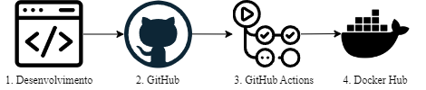
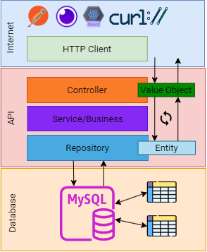

[](https://hub.docker.com/repository/docker/renandocker123/springboot_react_app)
[](https://hub.docker.com/repository/docker/springboot_backend_mysql)
[](https://github.com/renaner123/springboot_react_mysql/actions/workflows/continuos-integration.yml)


<!-- ABOUT THE PROJECT -->
## Sobre o projeto

O projeto é uma aplicação de API RESTful, seguindo  desenvolvida utilizando Spring Boot 3 e Java 21. Decidi trabalhar nesse projeto para aprimorar minhas habilidades em desenvolvimento de software e revisar conceitos arquiteturais REST/RESTful.

O objetivo principal do projeto é criar uma API robusta e escalável que integre-se com um banco de dados MySQL e ofereça suporte a diferentes formatos de conteúdo, como JSON, XML e YAML, através da negociação de conteúdo. Implementei também autenticação com JWT e Spring Security para garantir a segurança da API.

Um dos principais desafios durante a implementação foi lidar com o versionamento da API e garantir a compatibilidade entre as diferentes versões. Além disso, a integração com o Swagger Open API e a implementação de HATEOAS (nível 3 de maturidade REST) foram aspectos interessantes que exigiram uma compreensão mais aprofundada dos princípios RESTful.

Com esse projeto, aprendi/revisei não apenas sobre o desenvolvimento de API's RESTful com Spring Boot, mas também sobre boas práticas de desenvolvimento, como testes unitários e de integração com JUnit 5, Mockito e REST Assured. A dockerização da aplicação também foi uma experiência valiosa, permitindo uma implantação mais consistente e simplificada.

Em resumo, este projeto foi uma oportunidade de aplicar e consolidar meus conhecimentos em desenvolvimento de API's RESTful, além de proporcionar aprendizado contínuo em diversas áreas, desde conceitos arquiteturais até boas práticas de desenvolvimento e implantação de software.

### Construído com

- Server

[](https://spring.io/projects/spring-boot)
[](https://www.oracle.com/br/java/technologies/downloads/)
[](https://maven.apache.org/)
[](https://www.docker.com/)
[](https://www.mysql.com/)
[](https://www.postman.com/)
[](https://github.com/features/actions)
[](https://site.mockito.org/)
[](https://junit.org/junit5/)
[](https://rest-assured.io/)
[](https://www.testcontainers.org/)

- Client:

[](https://developer.mozilla.org/en-US/docs/Web/HTML)
[](https://developer.mozilla.org/en-US/docs/Web/CSS)
[](https://reactjs.org/)
[](https://nodejs.org/)


### GitHub Actions


Este repositório inclui um fluxo de trabalho do GitHub Actions que representa uma integração contínua (CI). Esse fluxo de trabalho é responsável por instalar, testar e enviar os serviços do repositório em forma de contêineres Docker para o DockerHub, preparando o projeto para ser implantado.

A adição de etapas de implantação contínua (CD) dependerá das necessidades específicas do projeto e do ambiente de implantação. Por exemplo, poderíamos adicionar etapas para implantar as imagens Docker em um ambiente de produção após a conclusão bem-sucedida da construção, ou ainda utilizar serviços específicos de provedores de nuvem para gerenciar o processo de implantação. Um exemplo de implantação na AWS se encontra na branch `aws-ci`.
#### Etapas

Abaixo é possível observar as etapas realizadas desde o desenvolvimento até o envio para o Docker Hub, conforme configuração [fluxo de trabalho](.github/workflows/continuos-integration.yml).



1. Desenvolvedor comita o código e faz o PUSH para o GitHub na branch main.
2. O gatilho do GitHub inicia a construção no GitHub Actions
3. O GitHub Actions faz:
   1. Configuração do ambiente de execução (runs-on).
   2. Definição de uma matriz de versões de Java e Node.js para testar o aplicativo em várias configurações (strategy).
   3. Checkout do código-fonte (actions/checkout).
   4. Login no Docker Hub (docker/login-action).
   5. Configuração do ambiente Node.js (actions/setup-node).
   6. Instalação de dependências e compilação do frontend (npm install, npm run build).
   7. Configuração do ambiente Java (actions/setup-java).
   8. Construção do JAR do aplicativo (mvn clean package).
   9. Construção da imagem Docker (docker compose build).
   10. Envio das imagens Docker para o Docker Hub (docker push).
4. As imagens estão disponíveis para usar em qualquer ambiente com Docker Instalado.


## Tabela de conteúdos

<details>
  <summary>Tabela de conteúdos</summary>
  <ol>
    <li>
      <a href="#arquitetura">Arquitetura</a>
    </li>
    <li><a href="#features">Features</a></li>
    <li><a href="#começando">Começando</a></li>
      <ul>
        <li><a href="#pré-requisitos">Pré-requisitos</a></li>
        <li><a href="#instalação">Instalação</a></li>
        <li><a href="#instalação-usando-imagens-do-docker-hub">Instalação Usando imagens do Docker Hub</a></li>
      </ul>
    </li>
    <li><a href="#uso">Uso</a></li>
    <ul>
      <li><a href="#react-app---front-end">Consumo pelo React App</a></li>
      <li><a href="#postman">Consumo pelo Postman</a></li>
    </ul>
    <li><a href="#contribua-com-o-projeto">Contribua com o Projeto</a></li>
    <li><a href="#licença">Licença</a></li>
    <li><a href="#contato">Contato</a></li>
  </ol>
</details>

## Arquitetura

O projeto foi desenvolvido com base na arquitetura em camadas, utilizando padrões de arquitetura REST para garantir uma estrutura organizada e escalável. Nesta arquitetura, a comunicação entre o cliente e o servidor é realizada através do protocolo HTTP, onde o HTTP Client pode ser qualquer Cliente HTTP, como Postman, Insomnia, ou uma aplicação React.

A arquitetura em camadas ajuda a organizar e separar as preocupações da aplicação, facilitando a manutenção, escalabilidade e testabilidade do código. Cada camada possui responsabilidades específicas e claramente definidas, o que torna o código mais modular e fácil de entender.

O padrão REST (Representational State Transfer) é utilizado para definir uma interface uniforme entre os componentes da aplicação, promovendo uma comunicação consistente e eficiente. Isso permite que os recursos da aplicação sejam acessados de maneira padronizada, utilizando os métodos HTTP de forma adequada (GET, POST, PUT, DELETE, etc.) e seguindo os princípios RESTful, como recursos identificáveis por URLs e uso adequado dos códigos de status HTTP.

Além disso, o padrão Value Object foi empregado para garantir a segurança e a integridade dos dados. Ao expor os dados através de objetos de valor intermediários, é possível proteger a estrutura do banco de dados e facilitar a manutenção, evolução e versionamento dos endpoints da API. Por exemplo, ao adicionar uma nova coluna em uma entidade, basta criar outro Value Object, mantendo a compatibilidade com versões anteriores da API.

Na imagem abaixo, apresento uma visão simplificada da arquitetura do projeto, destacando as diferentes camadas e a interação entre elas.




## Features

O back-end do projeto fornece as seguintes features:

### Autenticação
1. **Gerar AccessToken:**
   - Permite aos usuários autenticarem-se na API gerando um AccessToken usando seu `username` e `password`. O AccessToken é um JWT (JSON Web Token) gerado usando um secret-key codificado em base64 e é usado para inicializar o algoritmo HMAC256, que assina os tokens JWT com uma validade de 1 hora.
2. **Atualizar AccessToken Expirado:**
   - Caso um AccessToken tenha expirado, esta funcionalidade permite decodificar o token com sucesso e gerar um novo token para o usuário.

### Book (Necessário autenticação)
1. **Listar todos os livros:**
   - Recupera todos os livros disponíveis no banco de dados.
2. **Atualizar um livro:**
   - Permite atualizar as informações de um livro existente no banco de dados.
3. **Adicionar um novo livro:**
   - Permite adicionar um novo livro à coleção do banco de dados.
4. **Procurar um livro:**
   - Busca por um livro específico com base no id informado.
5. **Deletar um livro:**
   - Remove um livro existente (pelo id) da coleção.

### Person (Necessário autenticação)
1. **Listar todas as pessoas:**
   - Recupera todas as pessoas cadastradas no banco de dados.
2. **Atualizar uma pessoa:**
   - Permite atualizar as informações de uma pessoa existente no banco de dados.
3. **Corrigir uma pessoa:**
   - Corrige as informações de uma pessoa existente (i.e mudar somente uma informação e não tudo).
4. **Adicionar uma nova pessoa:**
   - Permite adicionar uma nova pessoa à base de dados.
5. **Procurar uma pessoa:**
   - Busca por uma pessoa específica com base no id.
6. **Procurar uma pessoa:**
   - Busca por uma pessoa específica com base em uma parte do nome (e.g nan, retorna "renan", "nando", etc)
7. **Deletar uma pessoa:**
   - Remove uma pessoa existente (pelo id) da base de dados.

### Files (Necessário autenticação)
1. **Carregar um arquivo e salvar no armazenamento no ambiente de desenvolvimento:**
   - Permite carregar um arquivo para a API e salvá-lo no ambiente de desenvolvimento.
2. **Carregar múltiplos arquivos e salvar no armazenamento no ambiente de desenvolvimento:**
   - Permite carregar vários arquivos para a API e salvá-los no ambiente de desenvolvimento.
3. **Baixar um arquivo armazenado no ambiente de desenvolvimento:**
   - Permite baixar um arquivo específico que está armazenado no ambiente de desenvolvimento.

> Todos os recursos disponíveis, assim como, as informações necessárias para inserir no corpo do pedido e o retorno das requisições, podem ser vistas no [SwaggerHub](https://app.swaggerhub.com/apis/RENANRODOLFODEV/res-tful_api_with_java_21_and_spring_boot/0.0.1) ou no link do swagger-ui após execução do projeto.


<!-- GETTING STARTED -->
## Começando

Para obter uma cópia deste repositório e testar as funcionalidades, siga estas simples etapas abaixo.


### Pré-requisitos

- Ter instalado o [Docker](https://www.docker.com) e [Docker Compose](https://docs.docker.com/compose/)


### Instalação

Este é o cenário mais simples para subir o ambiente de desenvolvimento com um único comando. Tanto o `Client` quanto o `Server` são executados dentro de contêineres Docker, além do serviço do banco de dados, o `MySQL`.

No arquivo [`docker-compose.yml`](docker-compose.yml) foram feitas as configurações de inicialização dos serviços.

Para obter o código fonte disponível neste repositório, basta executar o comando abaixo:

```bash
cd ~
git clone https://github.com/renaner123/springboot_react_mysql.git
```

Em seguida, o usuário deve fazer o *build* da composição, executando os comandos abaixo:

```bash
cd springboot_react_mysql
docker compose build
```

Uma vez que esse processo tenha sido finalizado, é preciso iniciar os serviços de banco de dados da composição. Esse processo é realizado por meio do seguinte comando:

```bash
docker compose up -d db
```

É necessário aguardar que o processo anterior tenha sido finalizado, ou seja, o servidor MySQL dentro do contêiner deverá estar pronto para aceitar conexões. Por fim, pode-se executar os demais contêineres da composição com o comando abaixo:

```bash
docker compose up
```

:clap: Pronto! A composição está pronta para ser utilizada.

### Instalação usando imagens do Docker Hub

Além da instalação utilizando o `build` local, também é possível executar a aplicação sem utilizar o projeto através das imagens disponíveis no Docker Hub (enviadas pelo Actions do GitHub). Para isso, é necessário remover as etapas de `build` dos serviços `springboot_backend_mysql` e `react_app` do arquivo [`docker-compose.yml`](docker-compose.yml). 

Ou seja, para executar a aplicação é necessário apenas ter o docker-compose.yml sem o build e o Docker/Docker Compose instalado.

<!-- USAGE EXAMPLES -->
## Uso

### React APP - Front-end 

Para testar a aplicação utilizando o front-end de exemplo, é necessário acessar a URL do `front-end` e se autenticar conforme os dados da tabela abaixo. A aplicação faz o consumo da API utilizando o `axios`.

A aplicação React consome os seguintes recursos:

|Método| Endpoint| Serviço|
|-------|---------|--------|
|GET    |localhost:80/api/book/v1       | Lista todas os livros cadastrados no banco
|GET    |localhost:80/api/book/v1/{id}  | Lista as informações de um livro pelo id
|POST   |localhost:80/api/book/v1       | Cadastra um novo livro.
|PUT    |localhost:80/api/book/v1       | Altera informações de um livro. 
|DELETE |localhost:80/api/book/v1/{id}  | Deleta um livro pelo id
|POST   |localhost:80/auth/signin       | Fazer autenticação na aplicação

| Application | URL                                       | Credenciais        |
| ----------- | ------------------------------------------| -------------------|
| back-end    | http://localhost/swagger-ui/index.html#/  |                    |
| front-end   | http://localhost:3000                     | `renan/admin123`   |

> Todos os recursos disponíveis, assim como, as informações necessárias para inserir no corpo do pedido e o retorno das requisições, podem ser vistas no [SwaggerHub](https://app.swaggerhub.com/apis/RENANRODOLFODEV/res-tful_api_with_java_21_and_spring_boot/0.0.1) ou no link do swagger-ui.

### Postman

Para testar todas os recursos do back-end, deixei uma [coleção](RESTful%20API%20with%20Java%2021%20and%20Spring%20Boot%203.postman_collection.json) e um [environment](SPRING_BOOT_JAVA.postman_environment.json) que pode ser importadas no Postman ou outras ferramentas para interagir com APIs de maneira eficiente. 

> Todos os recursos disponíveis, assim como, as informações necessárias para inserir no corpo do pedido e o retorno das requisições, podem ser vistas no [SwaggerHub](https://app.swaggerhub.com/apis/RENANRODOLFODEV/res-tful_api_with_java_21_and_spring_boot/0.0.1) ou no link do swagger-ui.

## Contribua com o projeto

Contribuições são o que tornam a comunidade de código aberto um lugar tão incrível para aprender, inspirar e criar. Qualquer contribuição que você faça é muito apreciada.

Se você tiver uma sugestão que possa tornar isso melhor, por favor, faça um fork do repositório e crie um pull request. Você também pode simplesmente abrir uma issue com a tag "melhoria". Não se esqueça de dar uma estrela ao projeto! Obrigado novamente!

1. Faça um Fork do projeto
1. Crie sua branch de funcionalidade (`git checkout -b feature/AmazingFeature`)
1. Faça o commit de suas mudanças (`git commit -m 'Adicione alguma AmazingFeature'`)
1. Faça o push para a branch (`git push origin feature/AmazingFeature`)
1. Abra um Pull Request


## Licença

Distribuído sob a Licença MIT. Veja `LICENSE.txt` para mais informações.


## Contato

Renan Rodolfo da Silva

[](https://mail.google.com/mail/u/0/?fs=1&tf=cm&source=mailto&to=renanrodolfo.dev@gmail.com)
[](https://www.linkedin.com/in/renanrodolfo/)


